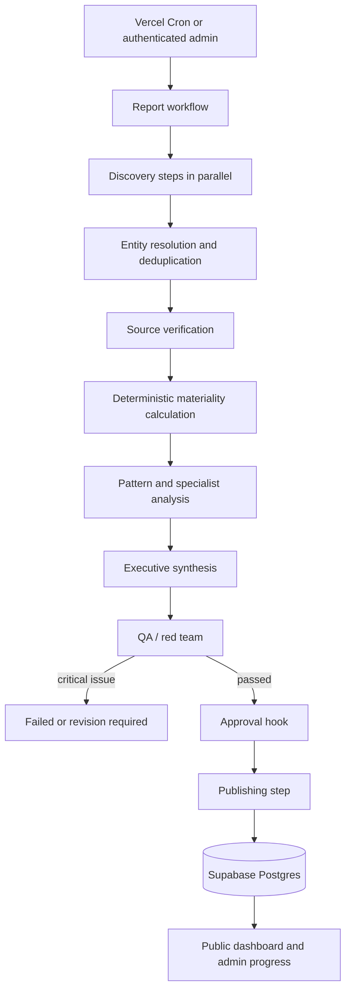

sed: --: No such file or directory
# Architecture

The workflow is deterministic and owns state, sequencing, retries, idempotency, cost ceilings and approval. Specialist agents make bounded judgements and return schema-validated data. They cannot publish.

## Trust boundaries

- Browser: publishable Supabase key only; all access passes through RLS.
- Next.js server: authenticates users and validates inputs.
- Durable steps: hold service credentials and call OpenAI/Supabase.
- Public UI: reads only published reports and approved evidence metadata.
- Admin UI: requires both a valid session and admin app metadata.

## Reporting-period idempotency

The unique `(period_start, period_end, version)` constraint makes the scheduled run idempotent. A rerun increments `version` and sets `is_rerun=true`. Event-level `dedupe_key` is unique within a run.
